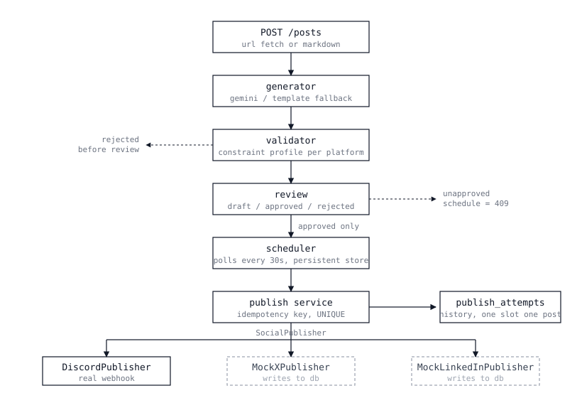
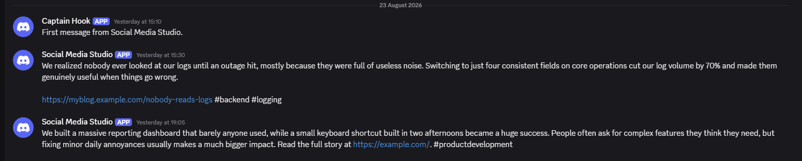

# Social Media Studio

FlyRank Backend Track, Capstone 01

You give it a blog post. It writes a version for Discord, X and LinkedIn, waits for you
to approve each one, and publishes them at the time you picked.

The posting part is easy. What took the work was everything around it. A retry after a
timeout must not post twice. A worker that dies halfway through must not duplicate when
it comes back. And nothing you have not read should ever go out.

---

## Architecture



A message the scheduler actually published:



---

## What you need

Python 3.11 or newer, and git. That is it. No database server, no Docker, nothing paid.

---

## Getting it running

```powershell
git clone https://github.com/UroojFatima-052/flyrank-capstone-social-studio.git
cd flyrank-capstone-social-studio
```

```powershell
python -m venv .venv
.\.venv\Scripts\Activate.ps1
```

On macOS or Linux use `source .venv/bin/activate`.

```powershell
pip install -r requirements.txt
```

Now set up your environment file:

```powershell
copy .env.example .env
```

Open `.env` and fill in two things:

- **`GEMINI_API_KEY`** for AI generation. Get one from
  [Google AI Studio](https://aistudio.google.com), free tier, no card needed.
- **`DISCORD_WEBHOOK_URL`** for real publishing. In Discord, right click a channel, then
  Edit Channel, Integrations, Webhooks, New Webhook, Copy Webhook URL.

Everything else in the file already has a working value.

You can skip both and the app still runs, but you get templates instead of AI and
Discord will not publish. See [running without keys](#running-without-keys) below.

```powershell
uvicorn app.main:app --reload
```

Then open http://127.0.0.1:8000/docs.

If something else already has port 8000, add `--port 8001`.

The database builds itself the first time you run it. Nothing to migrate.

---

## Configuration

| Variable | What it does | Default |
|---|---|---|
| `GEMINI_API_KEY` | Turns on AI generation. Leave it empty and you get templates. | empty |
| `GEMINI_MODEL` | Which model to call. | `gemini-3.6-flash` |
| `DISCORD_WEBHOOK_URL` | Turns on real Discord publishing. | empty |
| `DATABASE_URL` | SQLite unless you change it. | `sqlite:///./social_studio.db` |
| `DISCORD_ADAPTER` | Which adapter handles discord. Set it to `mock_x` and discord variants go to a mock instead. | `discord` |
| `X_ADAPTER` | Which adapter handles x. | `mock_x` |
| `LINKEDIN_ADAPTER` | Which adapter handles linkedin. | `mock_linkedin` |
| `SCHEDULER_ENABLED` | `false` runs the API without the background worker. | `true` |
| `SCHEDULER_INTERVAL_SECONDS` | How often the worker looks for due slots. | `30` |

`.env` is git-ignored. Do not commit it.

---

## Running without keys

If you skip the two keys above, the app still runs. Here is what changes, so nothing
surprises you.

**Variants come from templates, not the AI.** The templates cut on character count
rather than sentence endings, so a variant from a long post can stop mid-sentence, and a
long post will probably fail LinkedIn's eight sentence limit. Short posts come out clean
on all three platforms.

**Discord will not publish.** No webhook is set, so it fails with a message saying so. X
and LinkedIn still work, through their mock adapters.

**A post with no `source_url` gets `https://example.com`**, because every variant has to
carry a link.

Everything else runs normally. Ingestion, validation, review, scheduling, idempotent
publishing, crash recovery, publish history.

---

## Trying it

All of this works from `/docs`.

**Add a post.** `POST /posts`, either pasted markdown or a URL for it to fetch.

```json
{
  "title": "Delete the code, keep the comment",
  "content": "Commented-out code is the worst kind of documentation. Nobody knows if it is a fix waiting to happen or something that broke in 2019. Git already remembers it, so delete it and write a line explaining why it went if it matters.",
  "source_url": "https://example.com/delete-the-code"
}
```

**Create a campaign.** `POST /campaigns` with the post id and a name.

**Generate variants.** `POST /campaigns/{id}/variants`. You get back what was created,
what was skipped because it already existed, and what failed validation with the reason.

**Review them.** `POST /variants/{id}/approve` or `/reject`. `PATCH /variants/{id}`
changes the text, which revalidates it and drops it back to draft.

**Schedule one.** `POST /variants/{id}/schedule` with a UTC time in the future. Try it on
a draft first and you will get a 409.

```json
{ "scheduled_for": "2026-09-01T09:00:00" }
```

**Then wait.** The worker checks every 30 seconds. Watch the terminal, then look at
`GET /publish-history`.

---

## Tests

```powershell
pytest -v
```

42 of them. They run offline and need no keys. Each one gets its own in-memory database,
so they cannot interfere with each other or with your data.

---

## The parts that took thinking

**Nothing unreviewed goes out.** Status only changes through approve and reject
endpoints, never as a field you can patch. So there is no way to set a variant to
published from outside. Scheduling checks the status first and refuses anything that is
not approved.

**Nothing publishes twice.** Each attempt gets a key built from `(variant_id, slot_id)`,
stored with a UNIQUE constraint. The row goes in before the adapter is called, so the
insert is what decides whether you proceed, not an if statement. Two workers hitting it
at the same moment cannot both get through, because the database will not let them.

**A crash does not duplicate.** If the process dies mid-publish the attempt is left as in
progress. On restart those get marked failed rather than retried. I cannot tell whether
the message actually went out, and if I retry and it did, there are now two posts.
Marking it failed might leave a message that shows as failed but sent, which is at least
visible in the history for someone to check. One of those is fixable and the other is
not.

**Adding a platform means adding an adapter.** The app only ever talks to the
`SocialPublisher` interface. Which adapter handles which platform is a config value, so
swapping one out changes nothing else.

---

## What it does not do

**Template output is a trimmed extract, not a summary.** Without a Gemini key the
variants are cut on character count and can end mid-sentence, and long posts may fail the
LinkedIn sentence limit. That is the fallback behaving as designed.

**The AI is not deterministic.** Same post, same prompt, different output. Generating
from one long article failed the LinkedIn sentence limit on the first attempt and passed
on the next. Nothing invalid gets stored when that happens, the response says which
platform failed and why, and running the endpoint again fills in what is missing.

**Posts are not deduplicated.** Send the same content twice and you get two posts. Two
posts can reasonably share a title or content, unlike two campaigns with the same name
for one post. The guards sit further down where duplication actually costs something.

**No delete endpoints.** Records build up and there is no way to clear them through the
API. Deleting a post cleanly means deciding what happens to its campaigns, variants and
publish history, and a published variant probably should not be deletable at all given
the state machine treats published as final. Left out rather than done carelessly.

**Some sites refuse to be fetched.** Wikipedia sends a 403 to anything that does not look
like a browser. The fetcher says who it is rather than pretending, so those fail with a
clear message and you paste the content instead.

**Title detection is rough.** A page with no usable title tag falls back to the first line
of text.

**Publishing can be up to 30 seconds late**, because the worker polls instead of firing on
an exact trigger. That is on purpose. The slots table is the source of truth, so a slot
created while the worker was down still gets picked up.

**No login.** Single user. Adding tenancy would mean an owner column on every table and
auth on every endpoint, which is real work that does not exercise anything this capstone
is testing.

**The whole post goes to the AI.** Nothing is trimmed before the prompt, so a very long
article could hit a token limit.

---

## Where things live

```
app/
  adapters/     the SocialPublisher interface, Discord, the mocks, the registry
  routers/      HTTP layer
  services/     business logic
  scheduler/    worker and APScheduler setup
  models.py     database tables
  profiles.py   the rules for each platform
tests/          42 tests
docs/
  DESIGN.md         what I decided before writing any code
  DOD_TRACKER.md    definition of done checklist
  WORKFLOW.md       the phase plan
EVIDENCE.md     proof for each definition of done box
BUILDLOG.md     where AI helped and where it was wrong
```

---

## License

MIT